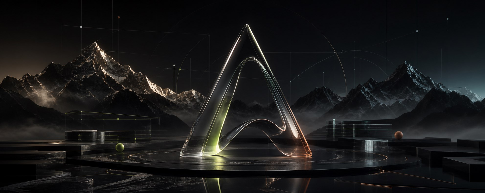

  

# AmirAli Hosseinzade

### Backend systems · Defensive infrastructure · High-craft interfaces

I build dependable web systems and expressive digital experiences—  
from reproducible security labs to fast, zero-dependency interfaces.

---

## What I care about

- **Resilience** — defensive architecture, observable systems, rate limiting, and infrastructure that fails gracefully.
- **Clarity** — practical documentation, reproducible labs, and code that explains its intent.
- **Craft** — interfaces with atmosphere and motion that remain accessible, responsive, and fast.
- **Lean engineering** — choosing the smallest dependable stack instead of complexity for its own sake.

## Selected work

<table>
  <tr>
    <td width="50%" valign="top">
      <h3><a href="https://github.com/Amir-Ali-Dev/ddos-defense-research">DDoS Defense Research</a></h3>
      
A defensive security knowledge base and reproducible local lab for detecting, mitigating, and designing around denial-of-service attacks.

      
<strong>Inside:</strong> Nginx controls, NestJS rate limiting, Redis-backed coordination, Cloudflare patterns, Docker lab scenarios, case studies, checklists, and bilingual English/Persian documentation.

      
<code>Nginx</code> <code>NestJS</code> <code>Redis</code> <code>Docker</code> <code>Cloudflare</code>

    </td>
    <td width="50%" valign="top">
      <h3><a href="https://github.com/Amir-Ali-Dev/noir-liquid-glass">NOIR — Liquid Glass</a></h3>
      
A cinematic adaptive-audio concept built as a polished, dependency-free web experience.

      
<strong>Inside:</strong> lightweight liquid motion, deliberate responsive layouts, accessible interaction states, viewport-aware animation, and a live GitHub Pages deployment.

      
<code>HTML</code> <code>CSS</code> <code>JavaScript</code> · <a href="https://amir-ali-dev.github.io/noir-liquid-glass/">Live experience ↗</a>

    </td>
  </tr>
</table>

## Current focus

I’m currently crafting **AERA**, a full-screen alpine-retreat experience centered on editorial storytelling, custom native scrolling, original visual identity, responsive composition, and fast browser-native motion.

Alongside it, I’m continuing to explore:

- resilient Node.js and NestJS service architecture;
- practical DDoS detection and mitigation patterns;
- performance-first UI systems with no unnecessary runtime weight;
- documentation that turns research into something other people can actually run.

## Toolbox

**Systems & backend**  
TypeScript · Node.js · NestJS · Redis · Nginx · Docker · Linux

**Web craft**  
HTML5 · CSS3 · JavaScript · Responsive Design · Accessibility · Web Performance

**Infrastructure & security**  
Cloudflare · Rate Limiting · Observability · Defensive Security · Resilient Architecture

---

### Build it clearly. Make it resilient. Give it character.

If you are working on a thoughtful web product, defensive infrastructure, or an interface that needs both speed and soul, feel free to reach out.

[Email](mailto:amiralihosseinzade169@gmail.com) · [Instagram](https://instagram.com/hos.senzade) · [Repositories](https://github.com/Amir-Ali-Dev?tab=repositories)

Tehran · Building in public on GitHub

