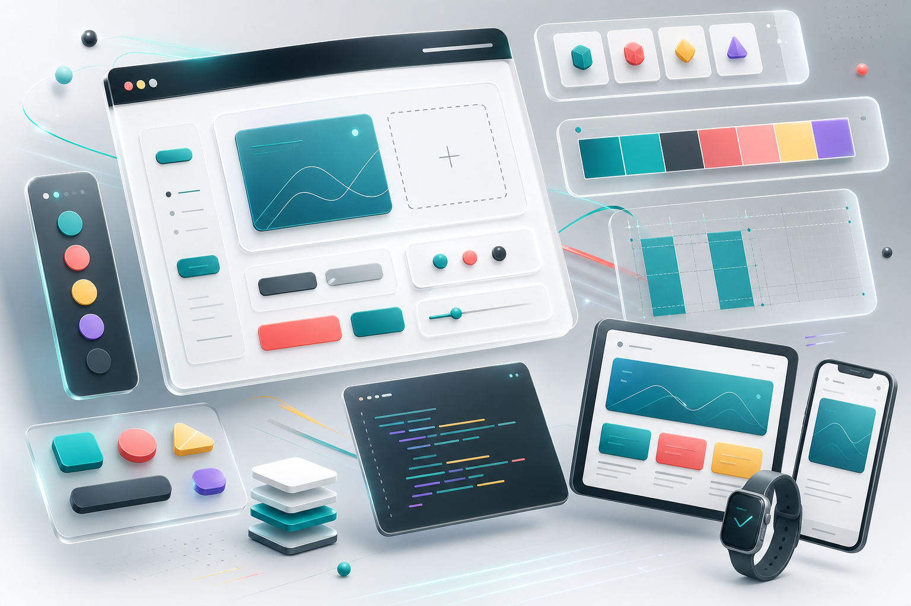

  

<h1 align="center">Hi, I'm AmirAli Hosseinzade</h1>
<h3 align="center">Senior Full-Stack Engineer building polished, scalable, production-ready web products.</h3>

  
  
  

  

---

## About

<table>
  <tr>
    <td width="54%" valign="top">
      

        I build modern web platforms from the interface down to the API,
        database, deployment pipeline, and monitoring layer. I care about
        fast products, clean architecture, readable code, and experiences
        that feel sharp the moment people open them.
      

      <ul>
        <li>Frontend systems with React, Vue, Next.js, TypeScript, and Tailwind CSS.</li>
        <li>Backend services with Node.js, NestJS, Python, Django, and Go.</li>
        <li>Databases, APIs, CI/CD, cloud deployment, and production reliability.</li>
        <li>Performance, maintainability, clean UX, and practical engineering decisions.</li>
      </ul>
    </td>
    <td width="46%" valign="top">
      
    </td>
  </tr>
</table>

## Engineering Focus

<table>
  <tr>
    <td width="50%" valign="top">
      
      <h3>Frontend Craft</h3>
      

        Responsive interfaces, component systems, accessible UI, motion,
        state management, and details that make products feel finished.
      

    </td>
    <td width="50%" valign="top">
      
      <h3>Backend & DevOps</h3>
      

        APIs, authentication, databases, automation, containers, cloud,
        monitoring, and systems built to stay understandable as they grow.
      

    </td>
  </tr>
</table>

## Tech Toolbox

  

  
  
  
  
  
  
  
  

## GitHub Analytics

  

  
  
  
  

  

  

## What I Like To Build

<table>
  <tr>
    <td width="33%" valign="top">
      <h3>Product Interfaces</h3>
      
Dashboards, panels, SaaS tools, admin systems, and polished web apps that are easy to scan and use.

    </td>
    <td width="33%" valign="top">
      <h3>API Platforms</h3>
      
Clear service boundaries, reliable authentication, clean data models, and maintainable backend workflows.

    </td>
    <td width="33%" valign="top">
      <h3>Automation</h3>
      
CI/CD, Dockerized delivery, monitoring, server workflows, and repeatable systems that reduce manual work.

    </td>
  </tr>
</table>

## Connect

  
  

  

